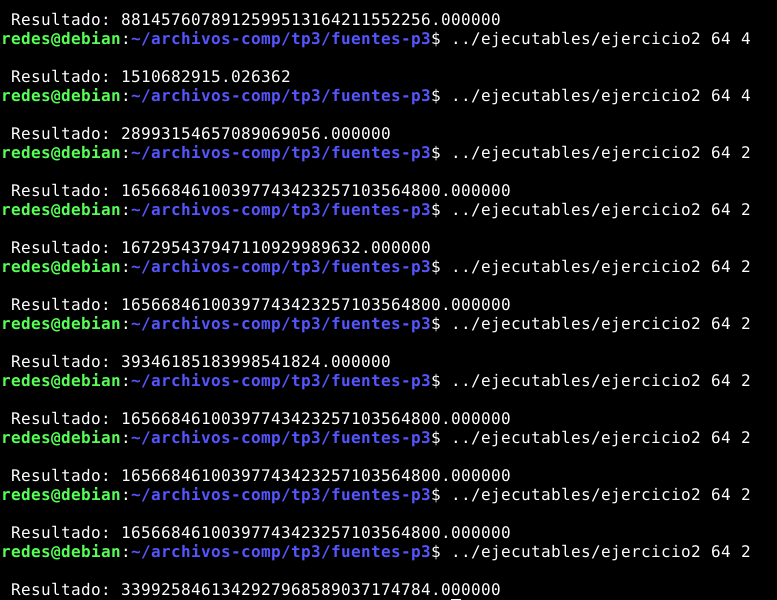

# Sistemas Paralelos - Práctica 2: Programación con Pthreads 

Información útil para compilar y ejecutar:
- Para compilar en Linux con gcc+OpenMP: `gcc -fopenmp –o salidaEjecutable archivoFuente`
- Para ejecutar: `./salidaEjecutable arg1 arg2 … argN`

## Ejercicios 
1. El programa `ejercicio1.c` inicializa una matriz de $NxN$ de la siguiente manera: $A[i,j]=i*j$, para todo $i,j=0..N-1$. Compile y ejecute. ¿Qué problemas tiene el programa? Corríjalo.
Problemas:
- No hace la validación de los parámetros de entrada, los que recibe el programa. 
- la instruccion `#pragma omp parallel for shared(A) private(i,j)` no se encuentra ubicada en el lugar correcto ya que si está dentro del bucle interno (iteración del índice `j`) se ingresa a la región paralela más de una vez, entonces queda: 
```c
 #pragma omp parallel for shared(A) private(i,j)
 for(i=0;i<N;i++){
   for(j=0;j<N;j++){
		A[i*N+j]=i*j;
   }
  }   
``` 


2. Analice y compile el programa `ejercicio2.c`. Ejecute varias veces y compare los resultados de salida para diferente número de threads. ¿Cuál es el problema? ¿Se le ocurre una solución? Nota: al compilar, agregue el flag `-lm`.



Siempre muestra un resultado diferente cuando se pide ejecutar más de una vez. No amerita paralelización, se puede realizar de forma secuencial. 

3. El programa `matrices.c` realiza la multiplicación de 2 matrices cuadradas de NxN (C=AxB). Utilizando la directiva `parallel for`paralelice de dos formas:
a. Repartiendo entre los threads el cálculo de las filas de C. Es decir, repartiendo el trabajo del primer for.
b. Repartiendo el cálculo de las columnas de cada fila de C. Es decir, repartiendo el trabajo del segundo for.
Compare los tiempos de ambas soluciones variando el número de threads. 